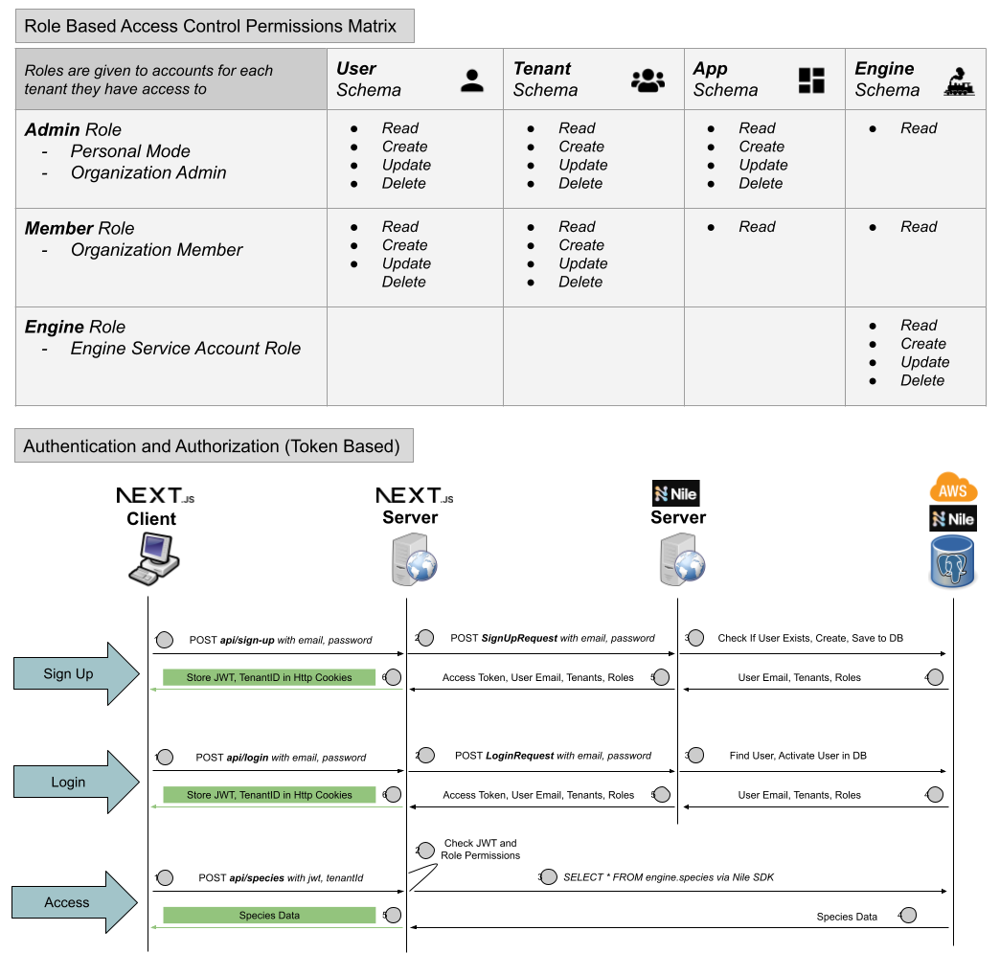

# Prana 🦚

  

## Mission

**Prana** aims to provide a seamless platform for individuals and organizations to explore, track, and protect biodiversity on earth. It gathers, organizes, aggregates, and surfaces insights from relevant public datasets so that users are brought closer than ever to the issue of biodiversity loss. It also provides mechanisms for users to find organiztions and causes to donate to, track their progress, and understand their impact in new and exciting ways. Upholding earth's incredible diversity of life is essential, and the overarching goal of Prana is to empower users and organizations with enhanced visibility into this problem, while making it fun, easy, and rewarding for them to be part of the solution.

## Technologies

##### Web App
🔥 [Next.js](https://nextjs.org) for the UI as well as API Routes.
✅ [TypeScript](https://www.typescriptlang.org) for type checking and with strict mode enabled.
✏️ [ESLint](https://eslint.org) for linting.
🛠 [Prettier](https://prettier.io) for automatic code formatting.
🚀 [Vercel](https://vercel.com/) for quick deployments and geolocated hosting.
🚣‍♀️ [Nile](https://www.thenile.dev/) for serverless, tenant virtualized data storage, authentication, and authorization.
🐶 [SWR](https://swr.vercel.app/) for data fetching.
🏗️ [Shadcn](https://ui.shadcn.com/) for component building blocks.
📝 [React Hook Form](https://www.react-hook-form.com/) for performant, flexible forms.
🎨 [Tailwind CSS](https://tailwindcss.com) for utility-first responsive styling.
⚛️ [Atomic Design](https://atomicdesign.bradfrost.com/chapter-2/) for a modular UI built up of atoms, molecules, organisms, layouts, and pages.
⚡ [Vitest](https://vitest.dev/) for unit testing components, hooks, and utilities.
🎭 [Playwright](https://playwright.dev/) for end-to-end testing.

##### Data Engine
🐍 [Python ](https://www.python.org/)for data collection, manipulation, aggregation.
🗄️ [SQL](https://en.wikipedia.org/wiki/SQL) for reading and writing to PostgresDB.

##### Data Powered by [The Nile](https://www.thenile.dev/)
🚣‍♀️ [Nile](https://www.thenile.dev/) for serverless, tenant virtualized data storage. Nile is a *serverless data platform* that aims to enable modern SaaS, like Prana. 
- Tenant isolation, per-tenant backups, and multi-tenant or dedicated infrastructure anywhere on the planet, all within an single database to interact with all these virtual tenant DBs
- Directing queries to a specific tenant DB and getting full data isolation is handled by the client library
- Ability to create shared tables that can be accessed by/across all tenants and are globally available
- Global and flexible tenant placement is critical for latency, performance isolation, compliance, and cost
- Dashboard provides insights into per-tenant performance, and management controls to perform admin operations on tenants and user
- First-class user management capabilities
- Domain and tenant-aware AI-native architecture
- Serverless and Cloud-Native
- World-class developer experience

##### Visual Documentation

## Data Sources

**Biodiversity 🦋**

* [Global Biodiversity](): Counts of birds, fish, mammals, vascular plants, and more by country
* [Global Biome](https://www.worldwildlife.org/publications/wildfinder-database): Biome classification metadata
* [Global Family](https://www.worldwildlife.org/publications/wildfinder-database): Family classification metadata
* [Global Genus](https://www.worldwildlife.org/publications/wildfinder-database): Genus classification metadata
* [Global Order](https://www.worldwildlife.org/publications/wildfinder-database): Order classification metadata
* [Global Species](https://www.worldwildlife.org/publications/wildfinder-database): Species classification metadata
* [Global Species Common Names](https://www.worldwildlife.org/publications/wildfinder-database): Species common names metadata
* [Global Red List Categories](https://www.worldwildlife.org/publications/wildfinder-database): Red List categories metadata
* [Global Red List Species](https://www.worldwildlife.org/publications/wildfinder-database): Species on the Red List
* [Global Eco Region](https://www.worldwildlife.org/publications/wildfinder-database): Eco regions around the world metadata
* [Global Eco Region Species](https://www.worldwildlife.org/publications/wildfinder-database): Species with ecoregion associated

**Emissions 🏭**

* [Global Methane Emissions](https://www.iea.org/data-and-statistics/data-product/methane-tracker-database-2023#emission-data): Methane emissons by country

**Location 🗺**

* [Global Cities](): Major cities in the world
* [USA Cities](https://simplemaps.com/data/us-cities): Cities in USA
* [USA ZIPs](https://simplemaps.com/data/us-zips): Zip codes in USA

**Weather 🌦**

* [Global Temperature](https://www.iea.org/data-and-statistics/data-product/weather-for-energy-tracker): Average temperature data by country by month
* [Global Temperature Month Year](https://www.iea.org/data-and-statistics/data-product/weather-for-energy-tracker#data-sets): Average temperature data by country by month and year
* [Global Precipitation](https://datacatalog.worldbank.org/search/dataset/0040276): Average precipitation by country by month

**Energy⚡**

* [Global Energy Balances](https://www.iea.org/data-and-statistics/data-product/world-energy-balances-highlights#data-sets): Energy balances by country
* [Global Energy Access](https://energydata.info/dataset/world-global-tracking-framework-2017): Energy access metrics by country
* [Global Renewable Energy](https://energydata.info/dataset/world-global-tracking-framework-2017): Renewable energy metrics by country
* [Global Energy Efficiency](https://energydata.info/dataset/world-global-tracking-framework-2017): Energy efficiency metrics by country
* [Global Electricity Production](https://www.iea.org/data-and-statistics/data-product/monthly-electricity-statistics#data-sets): Electricity production by country
* [Global Power Plant](https://datasets.wri.org/dataset/globalpowerplantdatabase): Power plants around the world metadata
* [Global Electric Vehicles](https://www.iea.org/data-and-statistics/data-product/global-ev-outlook-2023#data-sets): Electric vehicle data by country

**Industry 💵**

* [Global Industry Indicators](https://www.iea.org/data-and-statistics/data-product/energy-and-emissions-per-value-added-database): Industry indicators by country
* [Global Industry Value Add](https://www.iea.org/data-and-statistics/data-product/energy-and-emissions-per-value-added-database): Industry value add by country
* [Global Manufacturing Value Add](https://www.iea.org/data-and-statistics/data-product/energy-and-emissions-per-value-added-database): Manufacturing value add by country

**Health ❤️‍🩹**

- [Global WHO Indicators](http://www.exploredata.net/Downloads/WHO-Data-Set): Social, economic, health, and political indicators by country using data from the World Health Organization
